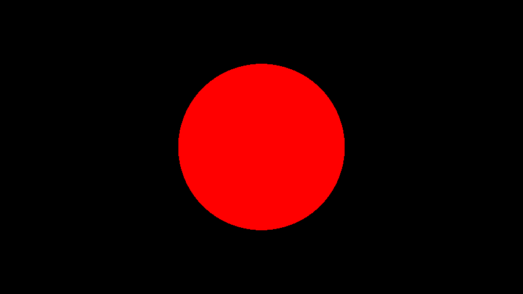
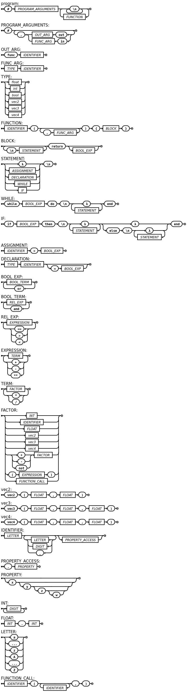

# SIGNED DISTANCE LANGUAGE

## Goal

The goal of this language is to abstract away the need for ray casting or ray marching in glsl implementations of renderers which use signed distance functions to render three dimensional scenes.

The language simplifies the process by requiring the user to define two main functions within the code: the **Signed Distance Function** and the  **Color Function** .

### Signed Distance Function

Each signed distance function should take a point in space (vec3) as input and return a single float representing the distance from the given point to the nearest surface in the scene.

Distances to surfaces are defined as positive values, representing the Euclidean distance from points outside the surface to the surface itself. For points lying within the surface, the distance is 0, and for points inside solid objects, the distance is represented as -1.

The backend renderer will employ the user-defined signed distance function within its volumetric integrator (also known as a ray marcher) to determine whether a specific pixel should be rendered onto the screen.

### Color Function

The color function should take a point in space (vec3) as input and return a vec4 representing the color that the point would have if rendered (with RGB values and alpha within the [0,1] interval).

For each pixel rendered on the screen, the renderer will consult the user-defined color function to determine the color that the pixel should have based on the position of the point being rendered as that pixel.

### Renderer

The language also needs a very simple back end renderer which will query the user defined functions and produce images of the function defined scene.

In the renderer below the SignedDistance and Color functions will come from the SDL user-written code.

```glsl
float MAX_RANGE = 100.0f;
float STEP_SIZE = 0.1f;
float THRESHOLD = 0.0001f;


void mainImage( out vec4 fragColor, in vec2 fragCoord )
{

    vec2 uv = fragCoord/iResolution.xy;
    float aspectRatio = iResolution.x / iResolution.y;
    uv.x *= aspectRatio;
  
    vec3 ro = vec3(uv.x,uv.y,0.0);
    vec3 rd = vec3(0.0,0.0,1.0f);
    vec3 col = vec3(0.0,0.0,0.0);
  
    for(float i = 0.0f; i*STEP_SIZE < MAX_RANGE; i++)
    {
        ro += rd*STEP_SIZE;
  
        vec3 worldPos = ro + rd * i * STEP_SIZE;
        if (SignedDistance(worldPos) < THRESHOLD) {
            vec3 sdfCol = Color(worldPos);
            col = sdfCol;
            break;
        }
    }

    fragColor = vec4(col,1.0);
}
```

### SDL Code:

```glsl
#in vec3 pos, out SignedDistance, out Color,

sqrt(float x){
    return x**0.5
}

length(vec3 v){
    return sqrt(v.x*v.x + v.y*v.y + v.z*v.z)
}

SignedDistance(vec3 pos){
    vec3 center = vec3(0.0,0.0,0.0)
    float radius = 5.0
    return length(pos - center) - radius
}

Color(vec3 pos){
    float r = 1.0
    float g = 0.0
    float b = 0.0
    float a = 0.0
    return vec4(r,g,b,a)
}
```

### Expected Output

The expected output for the above code in SDL is a sphere of radius 5.0 centered at the origin with a solid red color.



Full code in glsl that is needed to render the above sphere and that is being abstracted to SDL can be seen here:

https://www.shadertoy.com/view/MfcSz8

### Grammar

The EBNF for SDL is as follows:

```ebnf
program = '#',PROGRAM_ARGUMENTS,'\n',{'\n'},{FUNCTION,'\n',{'\n'}};
PROGRAM_ARGUMENTS = '#',{('out',OUT_ARG|'in',FUNC_ARG),','};
OUT_ARG = 'func', IDENTIFIER;
FUNC_ARG = TYPE, IDENTIFIER;
TYPE = float | int | bool | vec2 | vec3 | vec4;
FUNCTION = IDENTIFIER,'(',{FUNC_ARG,','},')','{',BLOCK,'}';
BLOCK = {STATEMENT,'\n'},'return', (BOOL_EXP | );
STATEMENT = ( "λ" | ASSIGNMENT |DECLARATION|WHILE | IF ), "\n" ;
WHILE = "while", BOOL_EXP, "do", "\n", "λ", { ( STATEMENT ), "λ" }, "end";
IF = "if", BOOL_EXP, "then", "\n", "λ", { ( STATEMENT ), "λ" }, ( "λ" | ( "else", "\n", "λ", { ( STATEMENT ), "λ" })), "end" ;
ASSIGNMENT = IDENTIFIER, '=', BOOL_EXP;
DECLARATION = TYPE, IDENTIFIER,('=', BOOL_EXP | );
BOOL_EXP = BOOL_TERM, { ("or"), BOOL_TERM } ;
BOOL_TERM = REL_EXP, { ("and"), REL_EXP } ;
REL_EXP = EXPRESSION, { ("==" | ">" | "<"), EXPRESSION } ;
EXPRESSION = TERM, {("+" | "-" | "**"), TERM};
TERM = FACTOR, { ("*" | "/"), FACTOR } ;
FACTOR = INT | IDENTIFIER | FLOAT | vec2 | vec3 | vec4 | (("+" | "-" | "not"), FACTOR ) | "(", EXPRESSION, ")"| FUNCTION_CALL ;
vec2 = 'vec2','(',FLOAT,',',FLOAT,')';
vec3 = 'vec3','(',FLOAT,',',FLOAT,',',FLOAT,')';vec4 = 'vec4','(',FLOAT,',',FLOAT,',',FLOAT,')';
IDENTIFIER = LETTER, { LETTER | DIGIT | "_" }, (PROPERTY_ACCESS |);
PROPERTY_ACCESS = '.', PROPERTY;
PROPERTY = ('x',('y',('z',('w',|) |) | ) ) | ;
INT =  DIGIT, { DIGIT };
FLOAT = INT,'.',INT;
LETTER = ( "a" | "..." | "z" | "A" | "..." | "Z" );
FUNCTION_CALL = IDENTIFIER,'(',{IDENTIFIER},',',')';
```

and its diagram can be seen here:


